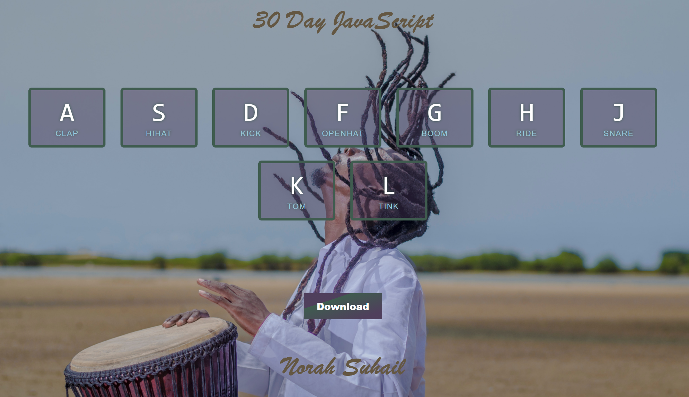
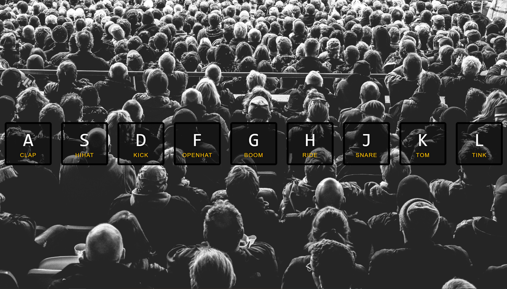

# 01 - JavaScript Drum Kit

## Building Tools
HTML, CSS and JavaScript.

## My Enhancments 
* Changed CSS Style.
* Changed HTML Structures.
* Save and Doenload the Melody.

## Screenshots

## Useful Links
* [Key Code Info](http://keycode.info/).
* Background Photo by <a href="https://unsplash.com/@nategreno?utm_source=unsplash&utm_medium=referral&utm_content=creditCopyText">Nate Greno</a> on <a href="https://unsplash.com/@nategreno/likes?utm_source=unsplash&utm_medium=referral&utm_content=creditCopyText">Unsplash</a>

## Author
* [Wes Bos](https://github.com/wesbos).
* Norah Suhail.